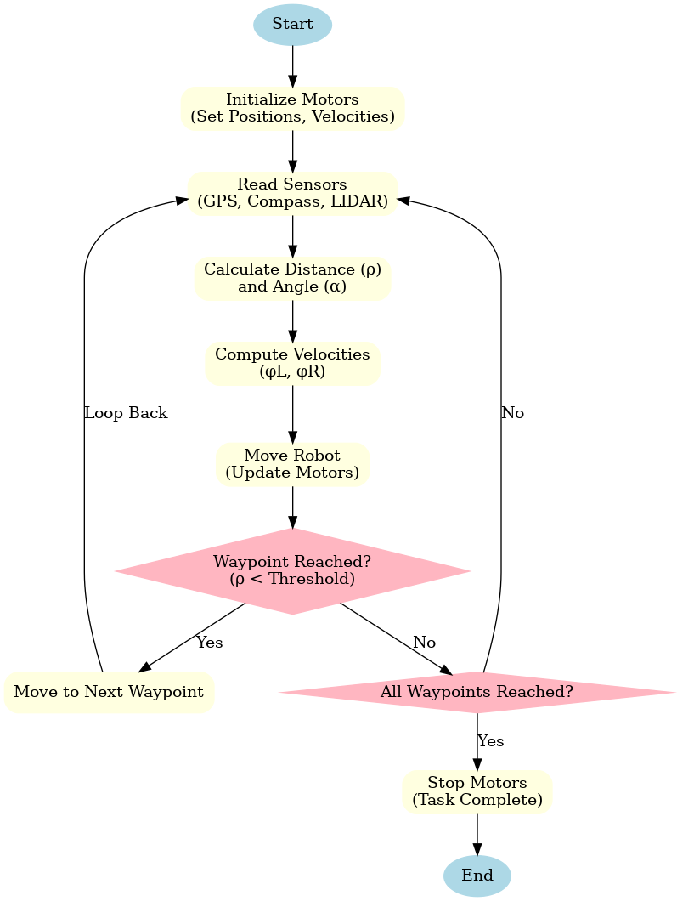
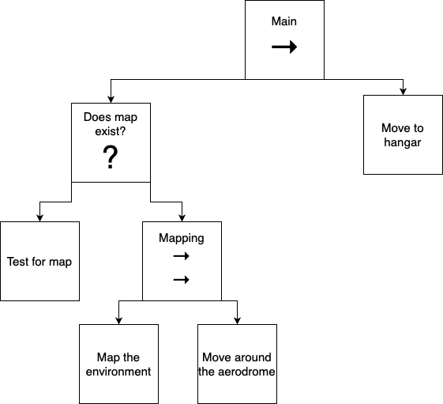

# Aircraft Tow Robot

Autonomous mobile robot that tows aircraft (a Learjet 35) inside an aerodrome and parks them in a hangar. Built in [Webots](https://cyberbotics.com/) with Python controllers as the final-year project for my **Mechatronics Engineering** degree at **UTEC** (Universidad Tecnológica del Uruguay), ITR Sur Oeste — Fray Bentos.

The robot maps the aerodrome with a 2D Hokuyo lidar, builds an occupancy grid, and then plans a path to the hangar. Four classical path planners are implemented and compared in the same world: **A\***, **Dijkstra**, **D\* Lite**, and **RRT**.

## Thesis

| | |
|---|---|
| **Title** | *Diseño de un Remolcador de Avionetas Autónomo Utilizando el Simulador Webots* |
| **Translation** | Design of an Autonomous Aircraft Tow Robot Using the Webots Simulator |
| **Code** | PIM20004 |
| **Degree** | Mechatronics Engineering — UTEC, ITR Sur Oeste (Fray Bentos, Uruguay) |
| **Author** | Juan Mathias Rosas Chaparro |
| **Tutor** | Diego Quiroga |
| **Co-tutor** | Yamile Lara |
| **Document** | [docs/thesis-es.pdf](docs/thesis-es.pdf) (Spanish) |
| **Defense slides** | [docs/defense-slides-es.pdf](docs/defense-slides-es.pdf) (Spanish) |

## Demo


## Repository layout

```
.
├── assets/meshes/        STL meshes shared by all worlds (hangar, robot, Learjet 35)
├── docs/
│   ├── thesis-es.pdf            Full thesis (Spanish)
│   ├── defense-slides-es.pdf    Defense presentation (Spanish)
│   └── figures/                 Diagrams from the thesis used in this README
├── webots/
│   ├── astar/            Webots project — A* planner
│   ├── dijkstra/         Webots project — Dijkstra planner
│   ├── dstar_lite/       Webots project — D* Lite planner
│   └── rrt/              Webots project — RRT planner
├── prototypes/
│   └── algorithm_visualizer.py   Standalone 2D path-planning visualizer (BFS / Dijkstra / A*)
└── results/
    ├── algorithms/       Comparison plots across the four planners
    ├── motors/           Motor / load characterization
    └── pid/              PID tuning sweeps
```

Each `webots/<algorithm>/` folder is a self-contained Webots project. They share the same robot, same hangar, same world layout — they only differ in the planning algorithm and a thin `planning.py` glue layer. The 3D meshes live once in `assets/meshes/` and every world references them via relative paths.

## 3D design

The robot's mechanical model — chassis, drive base, and the trailer-style aircraft coupling — was designed from scratch by the author in **Autodesk Fusion 360**, then exported to STL for use in the Webots simulator. The hangar and the Learjet 35 are third-party CGTrader STL models; everything else under [`assets/meshes/`](assets/meshes/) is original CAD work.

The aircraft coupling was redesigned in Fusion 360 to attach to the Learjet's nose wheel, and is configured in Webots as a free-rotating hinge joint between the robot and the towed aircraft.

## System architecture

Sensors and actuators selected during the thesis (Section 3.5), wired to a single Python controller running a `py_trees` behavior tree:

| Component | Webots node | Notes |
|---|---|---|
| Lidar | `HokuyoUtm30lx` | 270° FOV, 0.1–30 m range, 1080 × 0.25° resolution |
| GPS | `GPS` | Global localization on the aerodrome |
| Compass | `Compass` | Heading reference |
| Drive | 4 × `RotationalMotor` | Differential-style 4-wheel drive |
| Trailer joint | `HingeJoint` | Free-rotating attachment to the Learjet 35 |
| Display | `Display` | 300 × 300 occupancy-grid visualization |

The `Read Sensors → Compute Velocities → Move Robot → Check Waypoint` loop used during mapping and waypoint following, taken from the thesis (Figure 3.25, *Diagrama de flujo de movimiento del robot*):



## Behavior tree

The high-level controller is a behavior tree implemented with [`py_trees`](https://github.com/splintered-reality/py_trees). The tree first checks whether a map of the aerodrome already exists — if not, it runs a parallel mapping + perimeter-driving phase to build one — and then plans and drives a path to the hangar. The diagram below is the canonical version from the thesis (Figure 3.24, *Diagrama de árbol de comportamiento del robot*):



The three leaf behaviors map directly to Python modules in each Webots project's `BT_controller/`:

1. **Mapping** ([`mapping.py`](webots/astar/controllers/BT_controller/mapping.py)) — fuses lidar scans into a 300 × 300 occupancy grid while the robot loops around the aerodrome, dilates obstacles into a configuration space, and saves it as `cspace.npy`.
2. **Navigation** ([`navigation.py`](webots/astar/controllers/BT_controller/navigation.py)) — waypoint following with a P-controller on heading and forward speed; used during the mapping phase to drive the perimeter loop.
3. **Planning** ([`planning.py`](webots/astar/controllers/BT_controller/planning.py)) — once a map exists, plans a path from the current pose to the hangar using one of the four algorithms below, and re-plans on lidar-detected obstacles via a SLAM-style local rescan.

## Path planners

| Algorithm | File                      | Notes                                                                 |
|-----------|---------------------------|-----------------------------------------------------------------------|
| A\*       | `webots/astar/.../a_star.py`         | Euclidean heuristic, 8-connected grid                       |
| Dijkstra  | `webots/dijkstra/.../dijkstra.py`    | Uniform-cost reference                                      |
| D\* Lite  | `webots/dstar_lite/.../d_star_lite.py` | Incremental re-planner, ideal for unknown / changing maps |
| RRT       | `webots/rrt/.../rrt.py`              | Sampling-based, with an A\* smoothing pass                  |

Comparison plots (trajectory / distance / speed) are in [`results/algorithms/`](results/algorithms).

## Requirements

- [Webots R2023b](https://cyberbotics.com/) or newer
- Python 3.9+
- See [`requirements.txt`](requirements.txt) for Python packages

```bash
pip install -r requirements.txt
```

## Running a simulation

1. Open Webots.
2. **File → Open World…** and pick e.g. `webots/astar/worlds/Towbot.wbt`.
3. Make sure Webots is using the Python interpreter you installed the requirements into (`Tools → Preferences → Python command`).
4. Hit play.

The mapping phase runs until `cspace.npy` is saved (a few minutes of sim time). On subsequent runs the map is reused and the robot heads straight into planning.

To compare algorithms, just open a different `webots/<algo>/worlds/Towbot.wbt`. The shared meshes are pulled from `../../../assets/meshes/...`.

## Standalone path-planning visualizer

`prototypes/algorithm_visualizer.py` is a tiny matplotlib demo that runs BFS / Dijkstra / A\* on a random 20×30 grid — useful for sanity-checking the algorithms without spinning up Webots.

```bash
python prototypes/algorithm_visualizer.py
```

## License

[MIT](LICENSE)

## Author

Juan Mathias Rosas Chaparro — Mechatronics Engineering thesis, UTEC, ITR Sur Oeste (Fray Bentos, Uruguay).
